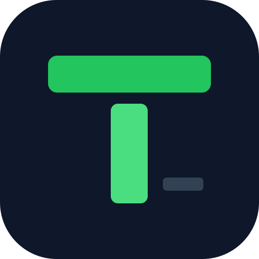

# Termez

A fast **SSH / SFTP manager** for Linux, macOS and Windows — a Termius-style desktop
client built with **Electron** (Chromium) + a **Rust** backend + **React**. Manage a fleet of servers, split
terminals, browse and move files, keep passwords and cloud storage, watch hosts
live, and back everything up to your own GitHub repo with end-to-end encryption.

> **Term** (terminal) + **Ez** (easy).

**[🌐 Website](https://minhngoc2512.github.io/termez/)** · **[⬇ Download](https://github.com/minhngoc2512/termez/releases/latest)** · **[📦 apt repo](https://minhngoc2512.github.io/termez/apt)**

---

## Download & install

Prebuilt installers for **Linux, macOS and Windows** are attached to every
[release](https://github.com/minhngoc2512/termez/releases/latest).

### Linux — via apt (recommended)

```bash
curl -fsSL https://minhngoc2512.github.io/termez/apt/termez-archive-keyring.gpg | sudo tee /usr/share/keyrings/termez.gpg >/dev/null
echo "deb [signed-by=/usr/share/keyrings/termez.gpg] https://minhngoc2512.github.io/termez/apt ./" | sudo tee /etc/apt/sources.list.d/termez.list
sudo apt update && sudo apt install termez
```

### Update

Update **only Termez** (leaves the rest of the system untouched):

```bash
sudo apt update && sudo apt install --only-upgrade termez
```

Handy checks:

```bash
apt policy termez                              # installed vs available version
apt list --upgradable 2>/dev/null | grep termez   # is a new version out?
```

`sudo apt upgrade` also updates Termez, but upgrades every other package too —
use the `--only-upgrade` command above if you just want the app. Settings →
About → **Check for updates** tells you when a new version is available.

### One-off `.deb`

Download the latest `Termez_*_amd64.deb` from
[**Releases**](https://github.com/minhngoc2512/termez/releases/latest), then:

```bash
sudo apt install ./Termez_*_amd64.deb
```

### Linux — portable `.AppImage`

Download `Termez_*_amd64.AppImage`, then:

```bash
chmod +x Termez_*_amd64.AppImage && ./Termez_*_amd64.AppImage
```

### macOS

Download **`Termez_*_universal.dmg`** (one build for both Apple Silicon and
Intel), open it and drag Termez to Applications.

> The app is **not notarized**, so the first launch is blocked by Gatekeeper.
> Right-click the app → **Open** → **Open**, or run once:
> `xattr -dr com.apple.quarantine /Applications/Termez.app`

### Windows

Download **`Termez_*_x64_en-US.msi`** (or `Termez_*_x64-setup.exe`) and run it.

> The installer is **unsigned**, so SmartScreen may warn: click **More info →
> Run anyway**.

An `.rpm` is also attached to each release. Maintainer packaging steps live in
[PACKAGING.md](PACKAGING.md).

---

## Features

**Terminals**
- SSH terminal with a real PTY (via [`russh`](https://crates.io/crates/russh), `ring` backend)
- **WebGL rendering** (auto-fallback) — no leftover "ghost" text when scrolling in vim/less;
  output is streamed per session and batched for fewer redraws
- **Find in terminal** (`Ctrl+Shift+F`): live highlight, match counter, next/prev, match case
- **Clickable links** in output, **Unicode 11** wide-char/emoji widths, and
  **OSC 52 clipboard** (yank in vim/tmux on the server → local clipboard)
- **Split view** (dockview): drag a tab to any edge to tile panes; drag to reorder/merge
- **Broadcast**: type once, send to every open pane
- Per-host **terminal theme & font size**; hover a tab to copy the host IP
- **Connection status popup** (Connecting → on failure: error + Retry / Exit)
- **Auto-reconnect** on network drop (a few tries with backoff), and the pane
  **auto-closes** when the shell exits (`exit`)
- **Live latency badge** per pane (SSH round-trip ping, works through jump/proxy)
- Optional **"wait for shell ready"** and a **Vietnamese input fix** (normalizes the
  no-break space some IMEs insert, so commands don't become "not found")

**Host management**
- Hosts in **collapsible groups**; home dashboard + header **search** by name / IP
- Password or **SSH key** auth (generate ed25519 / rsa, or import a key)
- **Test connection** button in the host form — verify reachability + auth before saving
- Per host: startup snippet, keep-alive, **SOCKS5 / HTTP CONNECT** proxy, and
  **jump host (ProxyJump, multi-hop)**
- **ProxyCommand** support + **`~/.ssh/config` import** — reach hosts behind
  Cloudflare Tunnel and other stdio proxies
- **Host key verification** (TOFU) with a **Known Hosts** view

**Passwords** (KeePassXC-style vault)
- Folder tree + entry table + detail pane; nested folders
- Import KeePass **`.kdbx`** files (folder structure preserved)
- Masked password field with reveal; `Ctrl+C` copy password / `Ctrl+U` copy URL
  with a **10-second auto-clearing clipboard** countdown

**SFTP**
- Dual-pane browser; **each pane picks any endpoint** (Local or any server)
- Transfer **Local ↔ Server** and **Server ↔ Server**, with a progress queue
- **Drag & drop** between panes; mkdir / delete

**Storage** (S3 / R2 / GCS / MinIO)
- Browse buckets, **upload / download / delete**, copy public URL
- Copy / cut / paste, new folder, multi-select, right-click menu
- **Drag-drop upload** with progress, speed and conflict resolution
- **Bucket-to-bucket transfer** in an SFTP-style dual pane (any provider to any)

**Port forwarding**
- **Local (-L)** and **Dynamic / SOCKS5 (-D)** tunnels, start/stop with live status

**Monitoring**
- Open a **per-host Monitor tab**: live CPU / RAM / disk / network charts

**Network scan**
- **LAN device discovery** (IP / MAC / vendor / hostname), host discovery and
  **port scan**, with a filter box — add a discovered host in one click

**Cloudflare DNS**
- Manage DNS records through the Cloudflare API (credentials stay local, never synced)

**Cloud sync** (optional)
- Back up hosts, keys, tunnels, **passwords and storage connections** to a
  **private GitHub repo**
- **End-to-end encrypted** (Argon2id + XChaCha20-Poly1305) with a master password
  — GitHub only ever stores ciphertext
- **Auto-pull** on startup and periodically, with **record-level 3-way merge**
  (per-record base/local/remote merge — edits on different devices no longer clobber)

**Security & app lock**
- Secrets live in the **OS keychain** (Secret Service), never plaintext in the DB
- **App Lock**: master password to open the app + **idle auto-lock**
- **Two-factor (TOTP)** with a configurable **re-authentication interval**

**Settings & updates**
- App theme **light / dark / system**, terminal theme & font size
- **In-app updates**: checks for a new version and, on the apt build, upgrades via
  `apt` (polkit prompts for the password) then relaunches with a changelog popup
- **About** panel with the current version

---

## Tech stack

| Layer | Tech |
|-------|------|
| Shell | Electron (Chromium), custom titlebar; Rust backend loaded as a native Node module (`napi-rs`) |
| SSH / SFTP | `russh` (ring), `russh-sftp` |
| Crypto | `argon2`, `chacha20poly1305`, `totp-rs` (2FA) |
| Proxy / tunnels | `tokio-socks`, `async-http-proxy`, ProxyCommand, direct-tcpip |
| Storage / cloud | S3 SigV4 (`reqwest`, `hmac`, `sha2`), GitHub Contents API |
| Local storage | SQLite (`sqlx`), OS keychain (`keyring`) |
| Frontend | React 19, TypeScript, Vite, Tailwind v4, shadcn/ui, lucide, xterm.js, dockview |

---

## Development

### Prerequisites
- **Rust** (stable) via [rustup](https://rustup.rs)
- **Node 22+** and **pnpm**
- Linux: `sudo apt install -y build-essential pkg-config libdbus-1-dev` (add `rpm` to build `.rpm`)

### Run

```bash
pnpm install
pnpm electron:native   # build the Rust backend (native Node module)
pnpm electron:dev      # Vite on :1520 + Electron
```

### Build installers

```bash
pnpm electron:build    # installers for the current OS → release/
```

`electron/build.cjs` builds the UI, the Rust module (universal on macOS), the
KeePass sidecar, then packages with electron-builder. The Rust backend lives in
`src-tauri/src` and is compiled unchanged through a small `tauri` shim crate
(`native/tauri-shim`); the command router is generated from `commands.rs`.

---

## Notes

- The keychain namespace is a stable internal string kept across renames so stored
  secrets are never orphaned.
- **Why Electron (since 0.3.0):** up to 0.2.x Termez used the OS webview; on Linux that
  is WebKitGTK, which scrolls the terminal (vim/less) visibly less smoothly than
  Chromium. Installers are larger as a result (≈100 MB `.deb` vs ≈8 MB before).
- **Upgrading from 0.2.x keeps everything:** same data folder and OS keychain; on
  Linux the UI preferences (theme, font size…) are migrated on first launch.
- VPN (OpenVPN) is intentionally **out of scope** — it needs root and changes
  system-wide routing; use a **jump host** or a **SOCKS tunnel** instead.

---

Built with [Claude Code](https://claude.com/claude-code).
